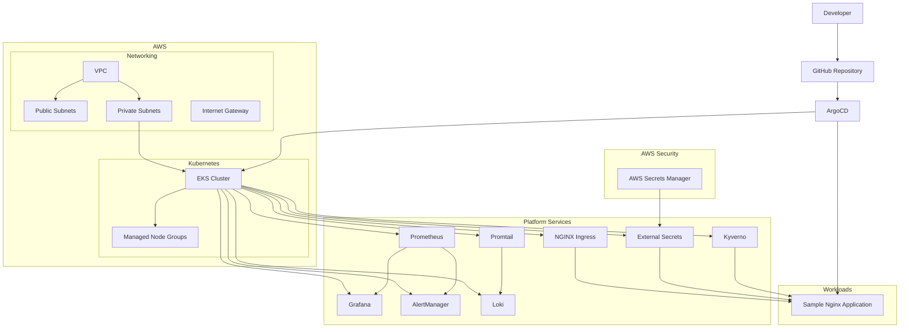

```mermaid
graph TB
    Developer[Developer]
    GitHub[GitHub Repository]
    Developer --> GitHub
    GitHub --> ArgoCD
    subgraph AWS
        subgraph Networking
            VPC[VPC]
            PublicSubnets[Public Subnets]
            PrivateSubnets[Private Subnets]
            InternetGateway[Internet Gateway] 
            end
            subgraph Kubernetes
                EKS[EKS Cluster]
                NodeGroup[Managed Node Groups]
            end
        end
        VPC --> PublicSubnets
        VPC --> PrivateSubnets
        PrivateSubnets --> EKS
        EKS --> NodeGroup
        ArgoCD --> EKS
        subgraph Platform Services
            Ingress[NGINX Ingress]
            Prometheus[Prometheus]
            Grafana[Grafana]
            AlertManager[AlertManager] 
            Loki[Loki]
            Promtail[Promtail] 
            ExternalSecrets[External Secrets] 
            Kyverno[Kyverno] 
        end 
        EKS --> Ingress 
        EKS --> Prometheus 
        EKS --> Grafana 
        EKS --> AlertManager 
        EKS --> Loki 
        EKS --> Promtail 
        EKS --> ExternalSecrets 
        EKS --> Kyverno 
        Promtail --> Loki 
        Prometheus --> Grafana 
        Prometheus --> AlertManager 
        subgraph AWS Security 
            SecretsManager[AWS Secrets Manager] 
        end 
        SecretsManager --> ExternalSecrets 
        subgraph Workloads 
            SampleApp[Sample Nginx Application] 
        end 
        ArgoCD --> SampleApp 
        Ingress --> SampleApp 
        ExternalSecrets --> SampleApp 
        Kyverno --> SampleApp
```
